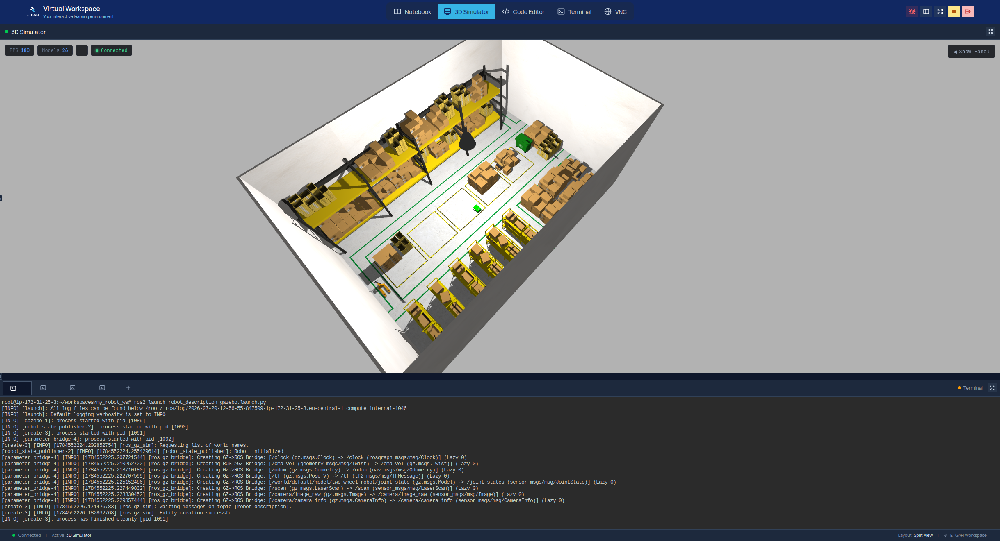
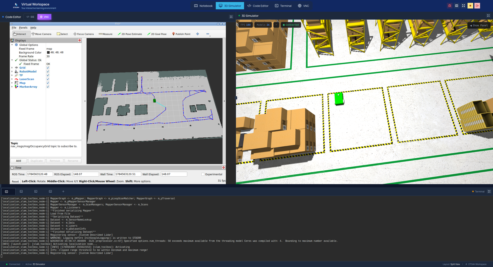
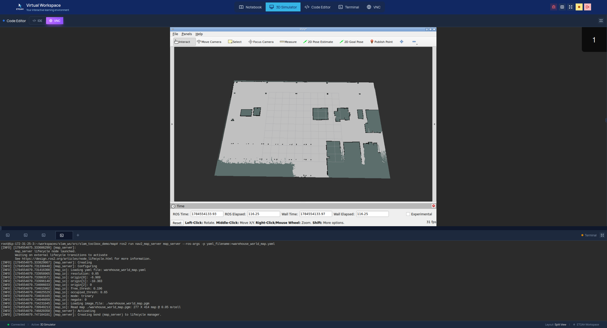
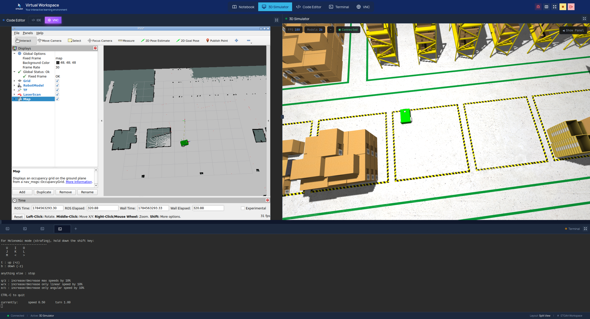
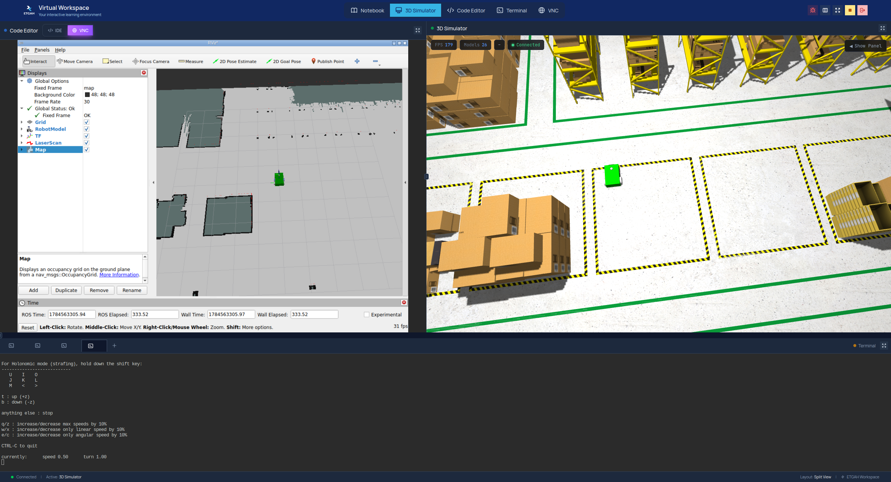
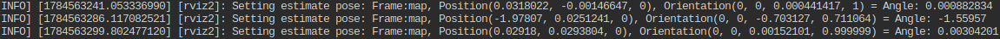

# SLAM Mapping & Localization — Ahmed Shalash

ROS 2 project built for the **"Map the World and Localize the Robot Within It"** assignment.
It builds a live occupancy map of a simulated warehouse using **SLAM Toolbox** and keyboard
teleop, saves that map and its pose graph, and then reloads them in **localization mode** so
the robot has to find its own pose inside the previously mapped world.

## Adaptation note

The assignment reference uses TurtleBot3 in `turtlebot3_world`. This repo instead uses a
**custom differential-drive robot (`two_wheel_robot`)** simulated with **Gazebo (`ros_gz`)**
inside the **AWS RoboMaker small warehouse world**. The mapping → save → localize → correct-pose
workflow required by the assignment is unchanged — only the robot model and world were swapped.
For that reason the saved map/pose-graph files are named `warehouse_world_map.*` and
`warehouse_world.*` rather than `turtlebot3_world_map.*`.

## Repository structure

```
slam_mapping_localization_ahmed_shalash/
├── robot_description/                  # Robot URDF/xacro, Gazebo spawn + gz_bridge, RViz configs
│   ├── urdf/                           # robot.urdf.xacro, robot.gazebo.xacro (diff-drive + lidar + camera)
│   ├── config/gz_bridge.yaml           # ROS <-> Gazebo topic bridge (cmd_vel, odom, tf, scan, camera)
│   ├── launch/gazebo.launch.py         # Spawns the robot inside the warehouse world
│   ├── launch/display.launch.py        # Standalone URDF viewer (joint_state_publisher_gui + rviz2)
│   └── rviz/                           # Saved RViz view configs
├── aws_robomaker_small_warehouse_world/# Third-party AWS RoboMaker warehouse world/models
├── slam_toolbox_demo/                  # <-- the package the assignment asks for
│   ├── config/
│   │   ├── slam_toolbox_online_async.yaml   # Mapping-mode parameters
│   │   └── slam_toolbox_localization.yaml   # Localization-mode parameters
│   ├── launch/
│   │   ├── slam_toolbox_online_async.launch.py   # Mapping launch
│   │   └── localization.launch.py                # Localization launch
│   ├── map/                            # Saved map: warehouse_world_map.yaml + .pgm
│   └── posegraph/                      # Serialized pose graph: warehouse_world.posegraph + .data
├── Screenshots/                        # Evidence screenshots referenced below
└── README.md
```

## Prerequisites

- Ubuntu + ROS 2 (developed with **Gazebo Harmonic** via `ros_gz` — adjust the `<ros-distro>`
  placeholder below to your installed distro, e.g. `jazzy`, `humble`).
- `colcon` and the standard ROS 2 dev tools.
- The following packages are used by the launch files but are **not currently pinned in the
  `package.xml` files**, so install them manually before building:

```bash
sudo apt update
sudo apt install \
  ros-<ros-distro>-ros-gz \
  ros-<ros-distro>-xacro \
  ros-<ros-distro>-robot-state-publisher \
  ros-<ros-distro>-joint-state-publisher-gui \
  ros-<ros-distro>-rviz2 \
  ros-<ros-distro>-slam-toolbox \
  ros-<ros-distro>-teleop-twist-keyboard \
  ros-<ros-distro>-nav2-map-server
```

## 1. Workspace setup

```bash
mkdir -p ~/ros2_ws/src
cd ~/ros2_ws/src
git clone https://github.com/Shalash500/slam_mapping_localization_ahmed_shalash.git

cd ~/ros2_ws
colcon build
source install/setup.bash
```

Run `source install/setup.bash` in **every new terminal** you open below.

## 2. Mapping phase

Open four terminals, all sourced as above.

**Terminal 1 — Gazebo + robot**
```bash
ros2 launch robot_description gazebo.launch.py
```
Spawns `two_wheel_robot` inside the warehouse world and starts the ROS↔Gazebo bridge
(`/cmd_vel`, `/odom`, `/tf`, `/scan`, `/camera/*`).

**Terminal 2 — RViz**
```bash
rviz2
```
In RViz: set **Fixed Frame** to `map`, then add displays for **TF**, **RobotModel**,
**LaserScan** (`/scan`), and **Map** (`/map`). The `map` frame won't exist until Terminal 3
is running — RViz will just show a frame warning until then, which is expected.

**Terminal 3 — SLAM Toolbox (mapping mode)**
```bash
ros2 launch slam_toolbox_demo slam_toolbox_online_async.launch.py
```

**Terminal 4 — Keyboard teleop**
```bash
ros2 run teleop_twist_keyboard teleop_twist_keyboard
```
Drive the robot around the warehouse and watch the occupancy grid build up live in RViz
(see [Screenshots](#screenshots) below).

**Save the map and pose graph** once the world is fully explored (run in a spare terminal,
sourced, while Terminal 3 is still running):
```bash
ros2 service call /slam_toolbox/save_map slam_toolbox/srv/SaveMap \
  "{name: {data: '$HOME/ros2_ws/src/slam_mapping_localization_ahmed_shalash/slam_toolbox_demo/map/warehouse_world_map'}}"

ros2 service call /slam_toolbox/serialize_map slam_toolbox/srv/SerializePoseGraph \
  "{filename: '$HOME/ros2_ws/src/slam_mapping_localization_ahmed_shalash/slam_toolbox_demo/posegraph/warehouse_world'}"
```
This writes `warehouse_world_map.yaml/.pgm` into `slam_toolbox_demo/map/` and
`warehouse_world.posegraph/.data` into `slam_toolbox_demo/posegraph/` — both already
included in this repo from the author's mapping run.

Stop all four terminals (`Ctrl+C`) before starting localization.

## 3. Localization phase

> ⚠️ **Before you launch:** `slam_toolbox_demo/config/slam_toolbox_localization.yaml` has
> `map_file_name` hardcoded to the path used on the author's machine
> (`/root/workspaces/slam_ws/src/slam_toolbox_demo/posegraph/warehouse_world`). Edit that value
> to the **absolute path** of `posegraph/warehouse_world` on *your* machine
> (e.g. `/home/<you>/ros2_ws/src/slam_mapping_localization_ahmed_shalash/slam_toolbox_demo/posegraph/warehouse_world`),
> then rebuild (`colcon build`) so the updated config is installed.

**Terminal 1 — Gazebo + robot** (same as mapping)
```bash
ros2 launch robot_description gazebo.launch.py
```

**Terminal 2 — RViz** (same displays as before: Fixed Frame `map`, TF, RobotModel, LaserScan, Map)
```bash
rviz2
```

**Terminal 3 — SLAM Toolbox (localization mode)**
```bash
ros2 launch slam_toolbox_demo localization.launch.py
```
The saved map is published immediately from the deserialized pose graph.

**Give a deliberately wrong pose estimate:** in RViz, use the **2D Pose Estimate** tool and
click a location/heading that does *not* match the robot's real position in Gazebo. The laser
scan will clearly not line up with the map walls — see
`Screenshots/giving_wrong_position.png`.

**Correct it:** use **2D Pose Estimate** again, this time at the robot's actual position and
heading. The laser scan snaps onto the map walls — see
`Screenshots/giving_right_position.png`.

**Terminal 4 — Keyboard teleop**
```bash
ros2 run teleop_twist_keyboard teleop_twist_keyboard
```
Drive the robot around and confirm the map stays fixed while only the robot's pose
(`map → odom` transform) updates.

## Screenshots

| | |
|---|---|
|  | Robot spawned in the AWS RoboMaker warehouse world in Gazebo. |
|  | Driving the robot with keyboard teleop during mapping. |
|  | Occupancy grid building up in RViz (1/5). |
|  | Occupancy grid building up in RViz (2/5). |
|  | Occupancy grid building up in RViz (3/5). |
|  | Occupancy grid building up in RViz (4/5). |
|  | Occupancy grid, fully explored warehouse (5/5). |
|  | The saved `warehouse_world_map` reloaded and displayed in RViz. |
|  | **Localization — wrong pose estimate:** laser scan is offset from the map walls, confirming the pose is incorrect. |
|  | **Localization — correct pose estimate:** laser scan lines up with the map walls once the correct pose is given. |
|  | Terminal log of the `2D Pose Estimate` events sent to `slam_toolbox` (position/orientation printed for each estimate). |

*(Note: the filenames above contain spaces and are URL-encoded as `%20` for the Markdown
links to render correctly on GitHub.)*

## Demo video

Screen recording of the mapping run (driving the robot with teleop while the map builds live
in RViz):
[https://drive.google.com/file/d/1WuFKnmrWrOs0bbKYHbmSBnjDLkmHsBlN/view?usp=drive_link](https://drive.google.com/file/d/1WuFKnmrWrOs0bbKYHbmSBnjDLkmHsBlN/view?usp=drive_link)

## Still to add before submitting

Two checklist items from the assignment aren't captured in this repo yet:

- **TF tree screenshot** showing `map → odom → base_footprint → base_link`. Capture with:
  ```bash
  ros2 run rqt_tf_tree rqt_tf_tree
  # or, for a static image file:
  ros2 run tf2_tools view_frames
  ```
  Save the screenshot into `Screenshots/` and add it above.
- **Terminal output of `ros2 topic echo /odom`**, pasted into this README, e.g.:
  ```bash
  ros2 topic echo /odom
  ```
  ```
  # paste a representative sample of the /odom output here
  ```

## Expected output

**Mapping phase**
- `ros2 launch robot_description gazebo.launch.py` opens Gazebo with the robot in the warehouse world, no errors.
- `ros2 launch slam_toolbox_demo slam_toolbox_online_async.launch.py` starts `slam_toolbox` in mapping mode and configures/activates automatically.
- `/scan` and `/odom` are publishing; RViz's Map display grows as the robot is driven around.
- `save_map` / `serialize_map` service calls produce `warehouse_world_map.yaml/.pgm` and `warehouse_world.posegraph/.data`.

**Localization phase**
- `ros2 launch slam_toolbox_demo localization.launch.py` loads the saved pose graph and immediately publishes the static map.
- A wrong 2D Pose Estimate produces a visible mismatch between `/scan` and the map.
- A correct 2D Pose Estimate aligns the scan with the map walls.
- Driving afterward keeps the map fixed — only the robot's pose (the `map → odom` transform) changes.

## Known limitations

- `slam_toolbox_localization.yaml`'s `map_file_name` is an absolute path from the author's
  original machine/container and **must be edited per environment** (see the warning above).
- `robot_description/package.xml` and `slam_toolbox_demo/package.xml` don't declare
  `exec_depend`s for `ros_gz`, `xacro`, `slam_toolbox`, or `teleop_twist_keyboard` — install
  them manually as shown in [Prerequisites](#prerequisites) rather than relying on `rosdep`.
- Uses the AWS RoboMaker small warehouse world + a custom two-wheel robot instead of
  `turtlebot3_world`/TurtleBot3 (see [Adaptation note](#adaptation-note)).

## Author

Ahmed Shalash — [github.com/Shalash500/slam_mapping_localization_ahmed_shalash](https://github.com/Shalash500/slam_mapping_localization_ahmed_shalash)