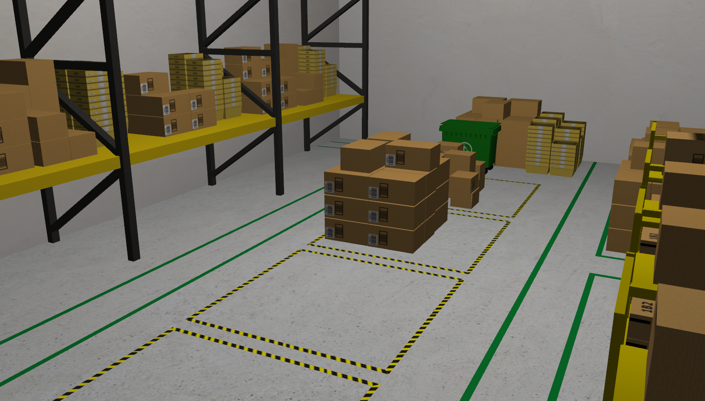
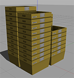
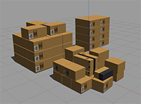
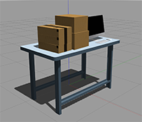
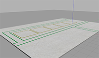
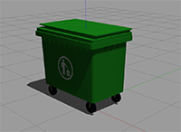
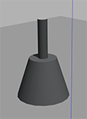
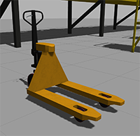
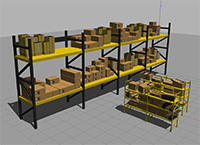

# AWS RoboMaker Small Warehouse World

This Gazebo world is well suited for organizations who are building and testing robot applications for warehouse and logistics use cases. 

## 3D Models included in this Gazebo World

| Model (/models)       | Picture           |
| :------------- |:-------------:|
| **aws_robomaker_warehouse_Bucket_01**    | 
| **aws_robomaker_warehouse_ClutteringA_01, aws_robomaker_warehouse_ClutteringC_01, aws_robomaker_warehouse_ClutteringD_01**     |  |
| **aws_robomaker_warehouse_DeskC_01**    | 
| **aws_robomaker_warehouse_GroundB_01**    | 
| **aws_robomaker_warehouse_TrashCanC_01**   | 
| **aws_robomaker_warehouse_Lamp_01**    | 
| **aws_robomaker_warehouse_PalletJackB_01**    | 
| **aws_robomaker_warehouse_ShelfD_01, aws_robomaker_warehouse_ShelfE_01, aws_robomaker_warehouse_ShelfF_01**    | 

## Acknowledgments

This project uses the **AWS RoboMaker Small Warehouse World** environment originally developed by the AWS Robotics team.

**Original Repository (ROS 1):**
https://github.com/aws-robotics/aws-robomaker-small-warehouse-world

The original repository was designed for **ROS 1** and Gazebo. Since this project is based on **ROS 2 Jazzy**, the warehouse world was adapted to be compatible with ROS 2. The migration and required modifications were performed with the assistance of **Claude AI**, while the integration, testing, and use within this project were completed as part of this work.

Credit goes to the AWS Robotics team for creating and openly sharing the original warehouse environment.

